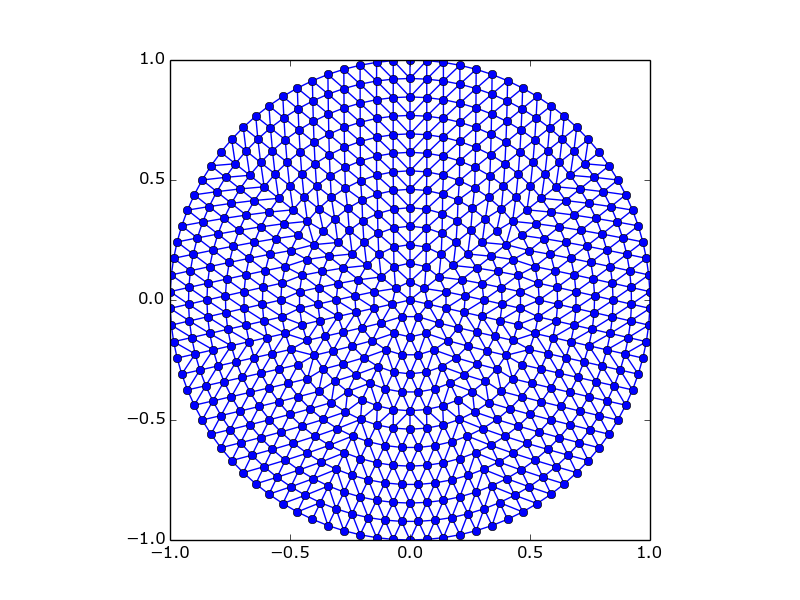
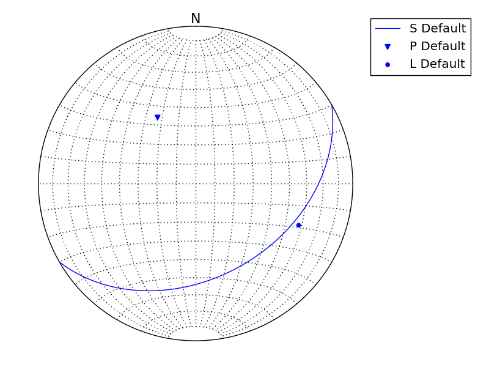
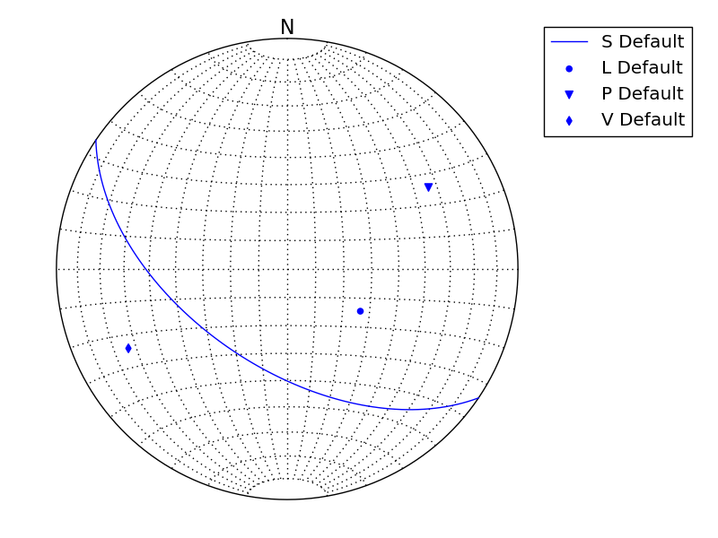
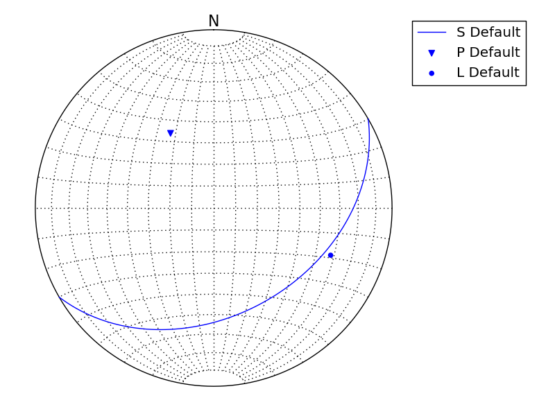
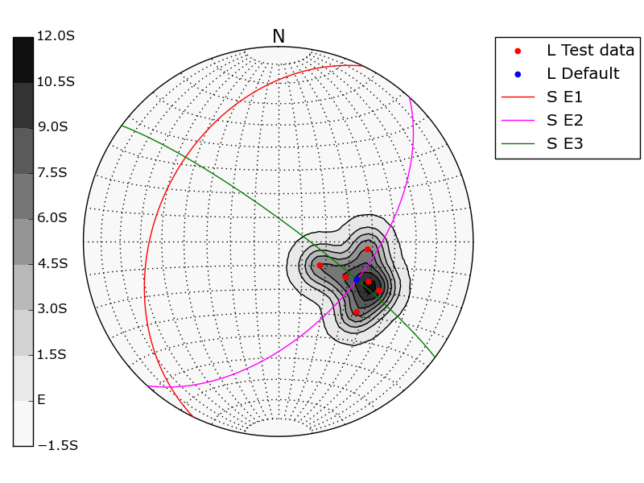
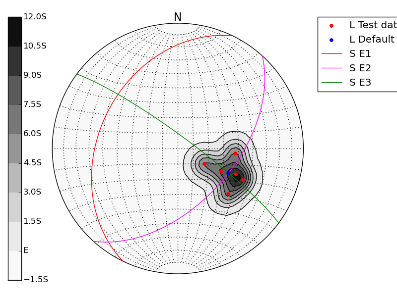
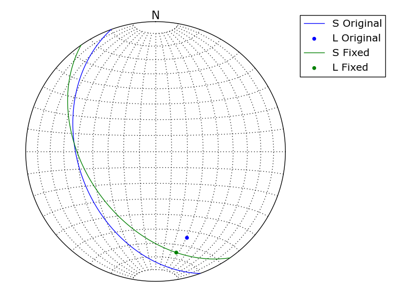

% Structural geology module for Python
% Ondrej Lexa <lexa.ondrej@gmail.com>
% 2014

Download and install APSG module
--------------------------------

APSG is distributed as a single file with no traditional python install
implemented yet. For now, download `apsg.py` file and save it to
working directory or to any folder on `PYTHONPATH`.

First steps with APSG module
============================

APSG defines several new python classes to easily manage, analyze
and visualize orientational structural geology data. Base class `Vec3`
is derived from `numpy.array` class and affers several new method
which will be explained on following examples.

Import APSG module
------------------

APSG module could be imported either into own namespace or into
active one for easier interactive work:

~~~~{.python}
>>> from apsg import *

~~~~~~~~~~~~~

Basic operations with vectors
----------------------------

Instance of vector object `Vec3` could be created from any iterable
object as list, tuple or array:

~~~~{.python}
>>> u = Vec3([1, -2, 3])
>>> v = Vec3([-2, 1, 1])

~~~~~~~~~~~~~

For common vector operation we can use standard mathematical operators
or special methods using dot notation:

~~~~{.python}
>>> u+v
V(-1.000, -1.000, 4.000)
>>> u-v
V(3.000, -3.000, 2.000)
>>> 3*u-2*v
V(7.000, -8.000, 7.000)

~~~~~~~~~~~~~

Its magnitude or length is most commonly defined as its Euclidean norm
and could be calculated using `abs`:

~~~~{.python}
>>> abs(v)
2.4494897427831779
>>> abs(u)
3.7416573867739413
>>> abs(2*u)
7.4833147735478827

~~~~~~~~~~~~~

For *dot product* we can use multiplification operator `*`
or `dot` method:

~~~~{.python}
>>> u*v
-1
>>> u.dot(v)
-1

~~~~~~~~~~~~~

For *cross product* we can use operator `**` or method `cross`:

~~~~{.python}
>>> u**v
V(-5.000, -7.000, -3.000)
>>> u.cross(v)
V(-5.000, -7.000, -3.000)

~~~~~~~~~~~~~

To project vector `u` onto vector `v` we can use
method `proj`:

~~~~{.python}
>>> u.proj(v)
V(0.333, -0.167, -0.167)

~~~~~~~~~~~~~

To find angle (in degrees) between to vectors we use method `angle`:

~~~~{.python}
>>> u.angle(v)
96.263952719927218

~~~~~~~~~~~~~

Method `rotate` provide possibility to rotate vector around
another vector. For example, to rotate vector `u` around
vector `v` for 45°:

~~~~{.python}
>>> u.rotate(v,45)
V(2.248, 0.558, 2.939)

~~~~~~~~~~~~~

Classes Fol a Lin
=================

To work with orientational data in structural geology, APSG
provide two classes derived from `Vec3` class. There is `Fol`
class to represent planar features by planes and `Lin` class
to represent linear feature by lines. Both classes provide all
`Vec3` methods, but they differ in way how instance is created
and how some operations are calculated, as structural geology
data are commonly axial in nature. The special class `Pole` is
derived from `Fol` and only differs in way how it is visualized
on stereographic projection.

To create instance of `Fol` or `Lin` class, we have to provide
dip direction and dip, both in degrees:

~~~~{.python}
>>> Lin(120,60)
L:120/60
>>> Fol(216,62)
S:216/62
>>> Pole(216,62)
P:216/62

~~~~~~~~~~~~~

or we can create instance from `Vec3` object:

~~~~{.python}
>>> u.aslin()
L:297/53
>>> u.asfol()
S:117/37
>>> u.aspole()
P:117/37

~~~~~~~~~~~~~

Vec3 methods for Fol a Lin
--------------------------

To find angle between two linear or planar features:

~~~~{.python}
>>> l1 = Lin(110,40)
>>> l2 = Lin(160,30)
>>> l1.angle(l2)
41.597412680035468
>>> p1 = Fol(330,50)
>>> p2 = Fol(250,40)
>>> p1.angle(p2)
54.696399321975328

~~~~~~~~~~~~~

To construct planar feature defined by two linear features:

~~~~{.python}
>>> l1**l2
S:113/40

~~~~~~~~~~~~~

To construct linear feature defined as intersection of two planar features:

~~~~{.python}
>>> p1**p2
L:278/36

~~~~~~~~~~~~~

**Cross product** of planar and linear features could be used to:

- construct plane defined by linear feature and normal
  of planar feature:

~~~~{.python}
>>> l2**p2
S:96/53

~~~~~~~~~~~~~

- or to find perpendicular linear feature on given plane.

~~~~{.python}
>>> p2**l2
L:276/37

~~~~~~~~~~~~~

To rotate structural features we can use method `rotate`:

~~~~{.python}
>>> p2.rotate(l2,45)
S:269/78

~~~~~~~~~~~~~

Dataset class
=============

`Dataset` class serve as list or container of `Fol` or `Lin` objects. It allows
grouping of features either for visualization or batch analysis.

~~~~{.python}
>>> d = Dataset(name='Test data')
>>> for dd in [Lin(120,60), Lin(116,50), Lin(132,45), Fol(90,60), Fol(84,52
)]:
...     d.append(dd)
... 
>>> print(d)
Test data:[L:120/60, L:116/50, L:132/45, S:90/60, S:84/52]

~~~~~~~~~~~~~

Same dataset could be created in simple way as:

~~~~{.python}
>>> d = Dataset([Lin(120,60), Lin(116,50), Lin(132,45),
...              Fol(90,60), Fol(84,52)], name='Test data')
... 
>>> print(d)
Test data:[L:120/60, L:116/50, L:132/45, S:90/60, S:84/52]

~~~~~~~~~~~~~

Method `len` returns number of features in dataset:

~~~~{.python}
>>> len(d)
5

~~~~~~~~~~~~~

To select only linear or planar features we can use methods
`getlins` a `getfols`. Properties `numlin` a `numfol` gives
number of linear or planar features in dataset.

~~~~{.python}
>>> d.getlins()
Test data:[L:120/60, L:116/50, L:132/45]
>>> d.numlins
3
>>> d.getfols()
Test data:[S:90/60, S:84/52]
>>> d.numfols
2

~~~~~~~~~~~~~

Another property of dataset is `resultant`,which returns
mean or resultant of all features in dataset:

~~~~{.python}
>>> d.getlins().resultant
L:123/52
>>> d.getfols().resultant
S:87/56

~~~~~~~~~~~~~

To measure angles between all features in dataset and another feature,
we can use method `angle`:

~~~~{.python}
>>> d = Dataset([Lin(120,60), Lin(116,50), Lin(132,45), Lin(95,52)])
>>> d.angle(d.resultant)
array([  7.74624256,   2.54411184,  12.80183755,  12.94898331])

~~~~~~~~~~~~~

To rotate all features in dataset around another feature,
we can use method `rotate`:

~~~~{.python}
>>> d.rotate(l1, 45)
R-Default:[L:90/57, L:103/50, L:120/55, L:89/41]

~~~~~~~~~~~~~

Ortensor class
==============

`Ortensor` class represents orientation tensor of set of planar
or linear features. Eigenvalues and eigenvectors could be obtained
by methods `eigenvals` and `eigenvects`. Eigenvectors could be also
represented by linear or planar features using properties eigenlins
and eigenfols.

~~~~{.python}
>>> ot = Ortensor(d)
>>> ot.eigenvals()
(0.97013794785464869, 0.023838538194604419, 0.006023513950748253)
>>> ot.eigenvects()
(V(0.269, -0.545, -0.794), V(-0.962, -0.185, -0.199), V(0.038, -0.818, 0.57
5))
>>> ot.eigenlins
(E1:[L:116/53], E2:[L:11/11], E3:[L:273/35])
>>> ot.eigenfols
(E1:[S:296/37], E2:[S:191/79], E3:[S:93/55])

~~~~~~~~~~~~~

Density class
=============

`Density` class represents Gaussian point density distribution of 
features from dataset. Parameters of calculation could be defined
by parameter `k` and by amount of counting points `npoints`. Number
of countours and color map could be modified by `nc` and `cm` properties.

~~~~{.python}
>>> c = Density(d, npoints=90)
>>> c
Density grid from 4 data with 6 contours.
Gridded on 90 points.
Values: k=100 E=0.04 s=0.14
Max. weight: 1.443
>>> c.plotcountgrid()

~~~~~~~~~~~~~

\

Schmidt projection
==================

Any `Fol`, `Lin`, `Pole`, `Vec3` or `Dataset` object could
be visualized in Schmidt projection:

~~~~{.python}
>>> SchmidtNet(Fol(214,55), Lin(120,60), Pole(240,60), Vec3([-1,-2,1]))
<apsg.SchmidtNet object at 0x7f1977bdd2d0>

~~~~~~~~~~~~~

\

Features could be added to Schmidt projection programatically as well:

~~~~{.python}
>>> s = SchmidtNet()
>>> s.add(Fol(150,40))
>>> s.add(Pole(150,40))
>>> s.add(Lin(112,30))
>>> s.show()

~~~~~~~~~~~~~

\

`Dataset` properties as color and name are used during visualization:

~~~~{.python}
>>> s.clear()
>>> d = Dataset([Lin(120,60), Lin(116,50), Lin(132,45), Lin(95,52)], name='
Test')
>>> s.add(d)
>>> s.add(d.ortensor)
>>> s.show()

~~~~~~~~~~~~~

\

All mentioned classes could be freely combined:

~~~~{.python}
>>> s.clear()
>>> d = Dataset([Lin(120,70), Lin(116,42), Lin(132,45),
...              Lin(95,52), Lin(114,48), Lin(118,58) ],
...             color='red', name='Test data')
... 
>>> s.add(d)
>>> s.add(d.resultant)
>>> s.add(*d.ortensor.eigenfols)
>>> c = Density(d, nc=8)
>>> s.add(c)
>>> s.show()

~~~~~~~~~~~~~

\

Some tricks
-----------

Double cross product is allowed:

~~~~{.python}
>>> s.clear()
>>> p = Fol(250,40)
>>> l = Lin(160,30)
>>> d = Dataset([p,l], color='blue', lines={'lw': 2}, points={'s': 60})
>>> d1 = Dataset([l**p, p**l], color='red', name='1CP')
>>> d2 = Dataset([p**l**p, l**p**l], color='green', name='2CP')
>>> s.add(d, d1, d2)
>>> s.show()

~~~~~~~~~~~~~

\

Correct measurements of planar linear pairs:

~~~~{.python}
>>> p1, l1 = fixpair(p,l)
>>> s.clear()
>>> d = Dataset([p, l], color='blue', name='Original')
>>> d1 = Dataset([p1, l1], color='green', name='Fixed')
>>> s.add(d, d1)
>>> s.show()

~~~~~~~~~~~~~

\
