========
Tutorial
========

**APSG** defines several new python classes to easily manage, analyze
and visualize orientation structural geology data. Base class ``Vec3``
is derived from ``numpy.array`` class and offers several new method
which will be explained in following examples.

Basic usage
-----------

**APSG** module could be imported either into own name space or into
active one for easier interactive work::

    >>> from apsg import *

Basic operations with vectors
-----------------------------

Instance of vector object ``Vec3`` could be created from any iterable
object as list, tuple or array::

    >>> u = Vec3([1, -2, 3])
    >>> v = Vec3([-2, 1, 1])

For common vector operation we can use standard mathematical operators
or special methods using dot notation::

    >>> u + v
    V(-1.000, -1.000, 4.000)
    >>> u - v
    V(3.000, -3.000, 2.000)
    >>> 3*u - 2*v
    V(7.000, -8.000, 7.000)

Its magnitude or length is most commonly defined as its Euclidean norm
and could be calculated using ``abs``::

    >>> abs(v)
    2.4494897427831779
    >>> abs(u+v)
    4.2426406871192848

For *dot product* we can use multiplication operator ``*``
or ``dot`` method::

    >>> u*v
    -1
    >>> u.dot(v)
    -1

For *cross product* we can use operator ``**`` or method ``cross``::

    >>> u**v
    V(-5.000, -7.000, -3.000)
    >>> u.cross(v)
    V(-5.000, -7.000, -3.000)

To project vector ``u`` onto vector ``v`` we can use
method ``proj``::

    >>> u.proj(v)
    V(0.333, -0.167, -0.167)

To find angle (in degrees) between to vectors we use method ``angle``::

    >>> u.angle(v)
    96.263952719927218

Method ``rotate`` provide possibility to rotate vector around
another vector. For example, to rotate vector ``u`` around
vector ``v`` for 45°::

    >>> u.rotate(v, 45)
    V(2.248, 0.558, 2.939)

Classes Lin and Fol
-------------------

To work with orientation data in structural geology, **APSG**
provide two classes derived from ``Vec3`` class. There is ``Fol``
class to represent planar features by planes and ``Lin`` class
to represent linear feature by lines. Both classes provide all
``Vec3`` methods, but they differ in way how instance is created
and how some operations are calculated, as structural geology
data are commonly axial in nature.

To create instance of ``Lin`` or ``Fol`` class, we have to provide
dip direction and dip, both in degrees::

    >>> Lin(120, 60)
    L:120/60
    >>> Fol(216, 62)
    S:216/62

or we can create instance from ``Vec3`` object using ``aslin``
and ``asfol`` properties::

    >>> u.aslin
    L:297/53
    >>> u.asfol
    S:117/37

Vec3 methods for Lin and Fol
----------------------------

To find angle between two linear or planar features we can use method ``angle``::

    >>> l1 = Lin(110, 40)
    >>> l2 = Lin(160, 30)
    >>> l1.angle(l2)
    41.597412680035468
    >>> p1 = Fol(330, 50)
    >>> p2 = Fol(250, 40)
    >>> p1.angle(p2)
    54.696399321975328

We can use *cross product* to construct planar feature defined by two linear features::

    >>> l1**l2
    S:113/40

or to construct linear feature defined as intersection of two planar features::

    >>> p1**p2
    L:278/36

*Cross product* of planar and linear features could be used to construct
plane defined by linear feature and normal of planar feature::

    >>> l2**p2
    S:96/53

or to find perpendicular linear feature on given plane::

    >>> p2**l2
    L:276/37

To rotate structural features we can use method ``rotate``::

    >>> p2.rotate(l2, 45)
    S:269/78

Classes Pair and Fault
----------------------

To work with paired orientation data like foliations and lineations
or fault data in structural geology, **APSG** provide two base ``Pair``
class and derived ``Fault`` class. Both classes are instantiated
providing dip direction and dip of planar and linear measurements,
which are automatically orthogonalized. If misfit is too high,
warning is raised. The ``Fault`` class expects one more argument
providing sense of movement information, either 1 or -1.

To create instance of ``Pair`` class, we have to provide
dip direction and dip of planar and linear feature, both in degrees::

    >>> p = Pair(120, 40, 162, 28)
    >>> p
    P:118/39-163/30
    >>> p.misfit
    3.5623168411508175
    >>> type(p)
    <class 'apsg.core.Pair'>

Planar and linear features are accessible using ``fol`` and ``lin``
properties::

    >>> p.fol
    S:118/39
    >>> p.lin
    L:163/30
    >>> type(p.fol)
    <class 'apsg.core.Fol'>
    >>> type(p.lin)
    <class 'apsg.core.Lin'>

To rotate ``Pair`` instance we can use ``rotate`` method::

    >>> p.rotate(Lin(45, 10), 60)
    P:314/83-237/61

Instantiation of ``Fault`` class is similar, we just have to provide argument
to define sense of movement::

    >>> f = Fault(120, 60, 110, 58, -1)  # -1 for normal fault
    >>> f
    F:120/59-110/59 -

Note the change in sense of movement after ``Fault`` rotation::

    >>> f.rotate(Lin(45, 10), 60)
    F:312/62-340/59 +

For simple fault analyses ``Fault`` class also provide ``p``, ``t``, ``m``
and ``d`` properties to get PT-axes, kinematic plane and dihedra
separation plane::

    >>> f.p
    L:315/75
    >>> f.t
    L:116/14
    >>> f.m
    S:27/85
    >>> f.d
    S:290/31

Group class
-----------

``Group`` class serve as a homogeneous container for ``Lin``, ``Fol`` and
``Vec3`` objects. It allows grouping of features either for visualization
or batch analysis::

    >>> g = Group([Lin(120,60), Lin(116,50), Lin(132,45), Lin(90,60), Lin(84,52)],
    >>>           name='L1')
    >>> g
    L1: 5 Lin

To simplify interactive group creation, you can use function ``G``::

    >>> g = G('120 60 116 50 132 45 90 60 84 52', name='L1')

Method ``len`` returns number of features in group::

    >>> len(g)
    5

Most of the ``Lin``, ``Fol`` and ``Vec3`` methods could be used for ``Group``
as well. For example, to measure angles between all features in group and
another feature, we can use method ``angle``::

    >>> g.angle(Lin(110,50))
    array([ 11.49989817,   3.85569115,  15.61367789,  15.11039885,  16.3947936 ])

To rotate all features in group around another feature,
we can use method ``rotate``::

    >>> gr = g.rotate(Lin(150, 30), 45)

To show data in list you can use ``data`` property::

    >>> gr.data
    [L:107/35, L:113/26, L:126/30, L:93/26, L:94/18]

Property ``R`` gives mean or resultant of all features in group. Note that
``Lin`` and ``Fol`` are axial in nature, so resultant vector is not reliable.
You can use ``ortensor`` property.::

    >>> g.R
    L:110/55

``Group`` class offers several methods to infer spherical statistics as
spherical variance, Fisher's statistics, confidence cones on
data etc.::

    >>> g.var
    0.02337168447438509
    >>> g.fisher_stats
    {'k': 34.229454059110871, 'a95': 13.264029905117329, 'csd': 13.844747281750971}
    >>> g.delta
    12.411724720740544

To calculate orientation tensor of all features in group, we can use
``ortensor`` property.::

    >>> g.ortensor
    Ortensor: L1 Kind: LLS
    (E1:0.954,E2:0.04021,E3:0.005749)
    [[ 0.07398181 -0.09605477 -0.14324311]
     [-0.09605477  0.28446118  0.42092899]
     [-0.14324311  0.42092899  0.64155701]]

Ortensor class
--------------

``Ortensor`` class represents orientation tensor of set of planar
or linear features. Eigenvalues and eigenvectors could be obtained
by methods ``eigenvals`` and ``eigenvects``. Eigenvectors could be also
represented by linear or planar features using properties ``eigenlins``
and ``eigenfols``. Several properties to describe orientation distribution
is also impleneted, e.g. Woodcock's ``shape`` and ``strength`` or Vollmer's
``P``, ``G``, ``R`` and ``C`` indexes.::

    >>> ot = Ortensor.from_group(g)
    >>> ot.eigenvals
    (0.954038468659639, 0.04021274946196462, 0.005748781878396576)
    >>> ot.eigenvects.data
    [V(0.192, -0.542, -0.818), V(-0.981, -0.082, -0.176), V(-0.028, -0.836, 0.547)]
    >>> ot.eigenlins.data
    [L:110/55, L:5/10, L:268/33]
    >>> ot.eigenfols.data
    [S:290/35, S:185/80, S:88/57]
    >>> ot.strength, ot.shape
    (5.111716009046873, 1.6278666609093613)
    >>> ot.P, ot.G, ot.R
    (0.91382571919767419, 0.068927935167136606, 0.017246345635188932)

StereoNet class
---------------

When ``StereoNet`` class instance is created with arguments, they are
immidiatelly plotted and shown. Most of the objects provided by **APSG**
could be plotted. Here we use the ``Group`` object and principal planes
and lines of ``Ortensor``:

    >>> StereoNet(g, ot.eigenfols, ot.eigenlins)

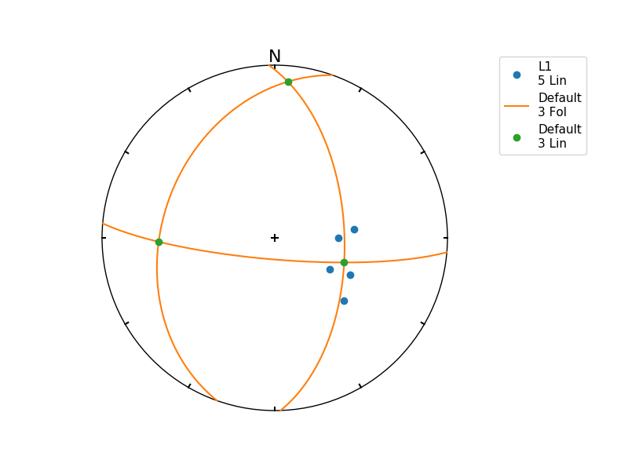

When ``StereoNet`` class instance is created without arguments,
several methods and properties could be used for additional operations.
To finalize plot we can use ``show`` method (not needed in jupyter
notebooks)

Any ``Fol``, ``Lin``, ``Group`` object could be visualized as plane,
line or pole in stereographic projection using ``StereoNet`` class::

    >>> s = StereoNet()
    >>> s.plane(Fol(150, 40))
    >>> s.pole(Fol(150, 40))
    >>> s.line(Lin(112, 30))
    >>> s.show()

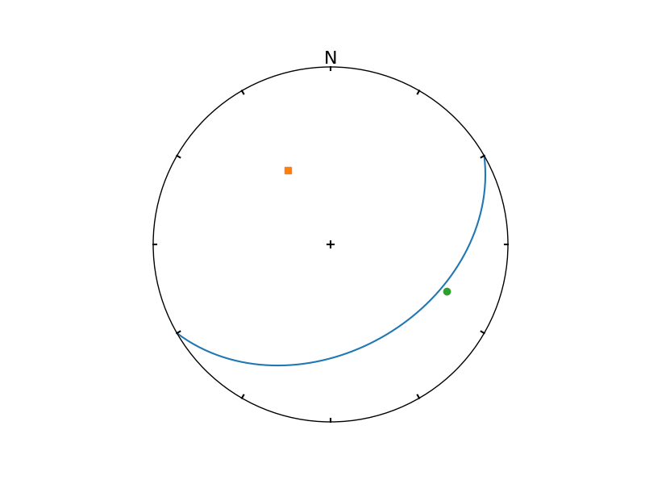

A cones (or small circles) could be plotted as well::

    >>> s = StereoNet()
    >>> g = Group.randn_lin(mean=Lin(40, 15))
    >>> s.line(g, 'k.')
    >>> s.cone(g.R, g.fisher_stats['a95'], 'r')  # confidence cone on resultant
    >>> s.cone(g.R, g.fisher_stats['csd'], 'g')  # confidence cone on 63% of data
    >>> s.show()

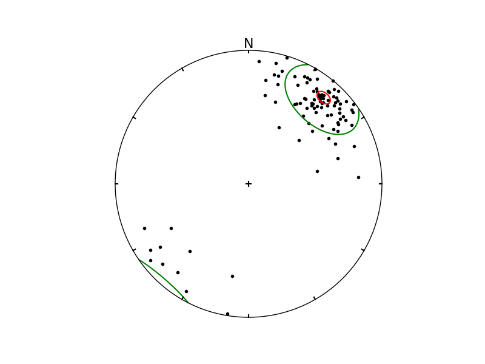

To make density contours plots, a ``contour`` and ``contourf``
methods are available::

    >>> s = StereoNet()
    >>> g = Group.randn_lin(mean=Lin(40, 20))
    >>> s.contourf(g, 8, legend=True, sigma=2)
    >>> s.line(g, 'g.')
    >>> s.show()

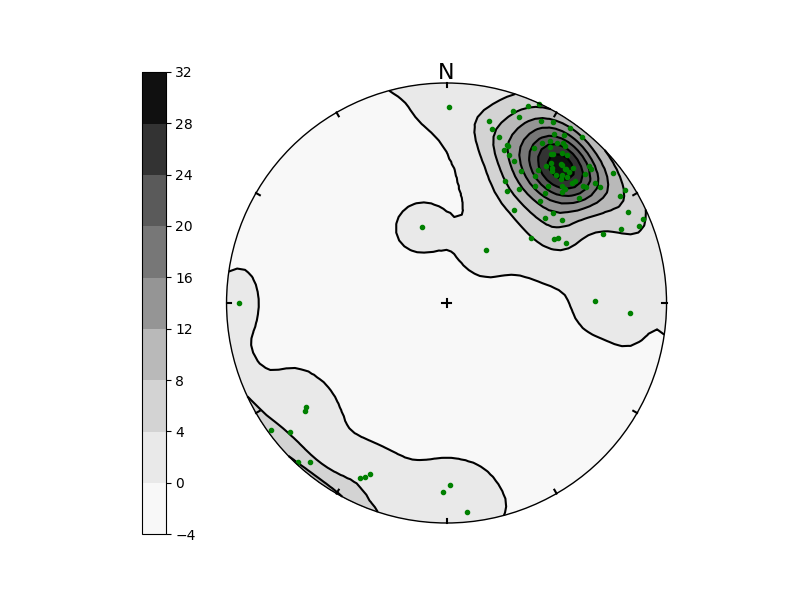

Except ``Group``, **APSG** provides ``PairSet`` and ``FaultSet`` classes
to store ``Pair`` or ``Fault`` datasets. It can be inicialized by passing
list of ``Pair`` or ``Fault`` objects as argument or use class
methods ``from_array`` or ``from_csv``:

    >>> p = PairSet([Pair(120, 30, 165, 20),
    >>>              Pair(215, 60, 280,35),
    >>>              Pair(324, 70, 35, 40)])
    >>> p.misfit
    array([ 2.0650076 ,  0.74600727,  0.83154705])
    >>> StereoNet(p)

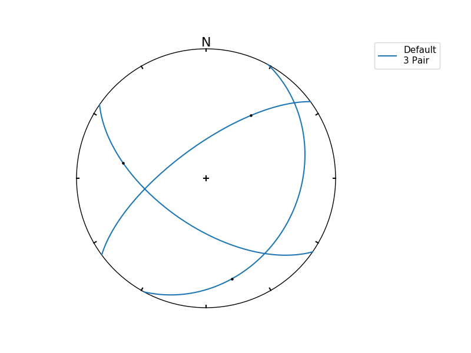

``StereoNet`` has two special methods to visualize fault data. Method ``fault`` produce classical Angelier plot::

    >>> f = FaultSet([Fault(170, 60, 182, 59, -1),
    >>>               Fault(210, 55, 195, 53, -1),
    >>>               Fault(10, 60, 15, 59, -1),
    >>>               Fault(355, 48, 22, 45, -1)])
    >>> s = StereoNet()
    >>> s.fault(f)
    >>> s.line(f.p, label='P-axes')
    >>> s.line(f.t, label='T-axes')
    >>> s.plane(f.m, label='M-planes')
    >>> s.show()

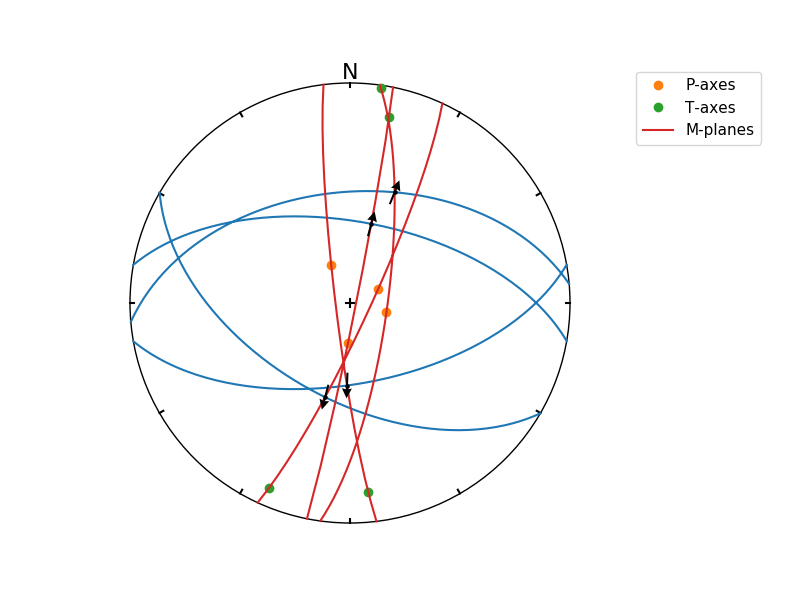

``hoeppner`` method produce Hoeppner diagram and must be invoked from
``StereoNet`` instance::

    >>> s = StereoNet()
    >>> s.hoeppner(f, label=repr(f))
    >>> s.show()

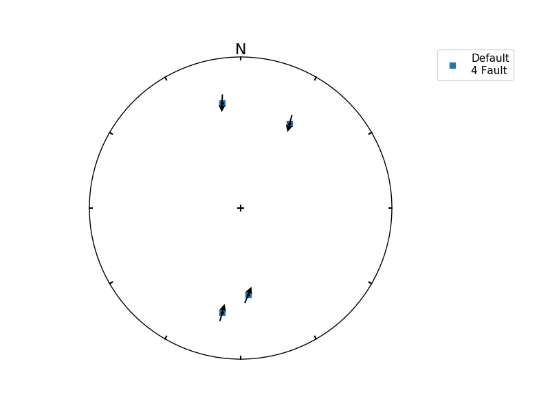

Note that ``fault`` method is used, when data are passed directly to
``StereoNet`` instance::

    >>> f = Fault(120, 60, 110, 58, -1)
    >>> StereoNet(f, f.m, f.d, f.p, f.t)

.. image:: _static/images/figure_12.png

StereoGrid class
----------------

``StereoGrid`` class allows to visualize any scalar field on StereoNet.
Internally it is used for plotting contour diagrams, but it exposes
``apply_func`` method to calculate scalar field by any user-defined
function. Function must accept three element ``numpy.array`` as first
argument passed from grid points of ``StereoGrid``.

Following example shows how to plot resolved shear stress on
plane from given stress tensor. ``StereoGrid.apply_func`` method is used
to calculate this value over all directions and finally values are
plotted by ``StereoNet``::

    >>> S = Stress([[-10, 2, -3],[2, -5, 1], [-3, 1, 2]])
    >>> d = StereoGrid()
    >>> d.apply_func(S.shear_stress)
    >>> s = StereoNet()
    >>> s.contourf(d, 10, legend=True)
    >>> s.show()

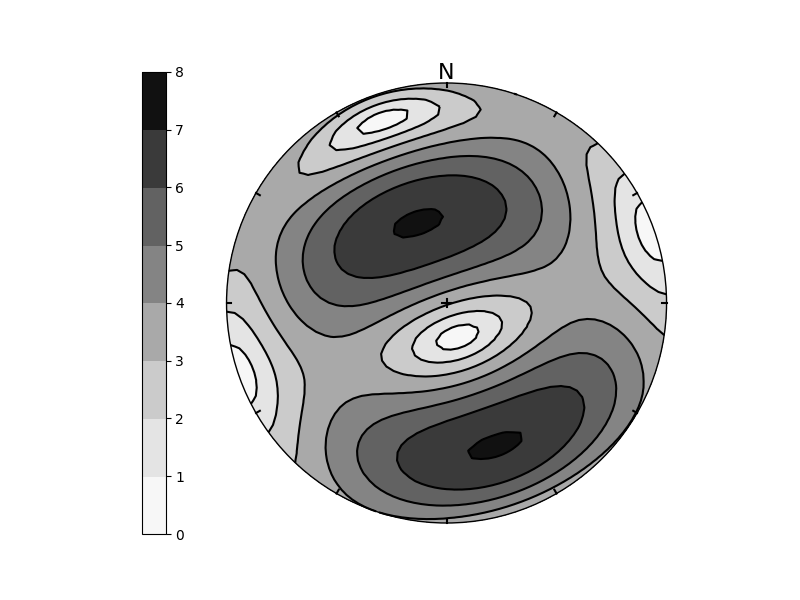

The ``FaultSet`` provide also ``amgmech`` method which provide access to
Angelier dihedra method. Results are stored in ``StereoGrid``. Default
behavior is to calculate counts (positive in extension, negative in
compression)::

    >>> f = FaultSet.examples('MELE')
    >>> StereoNet(f.angmech())

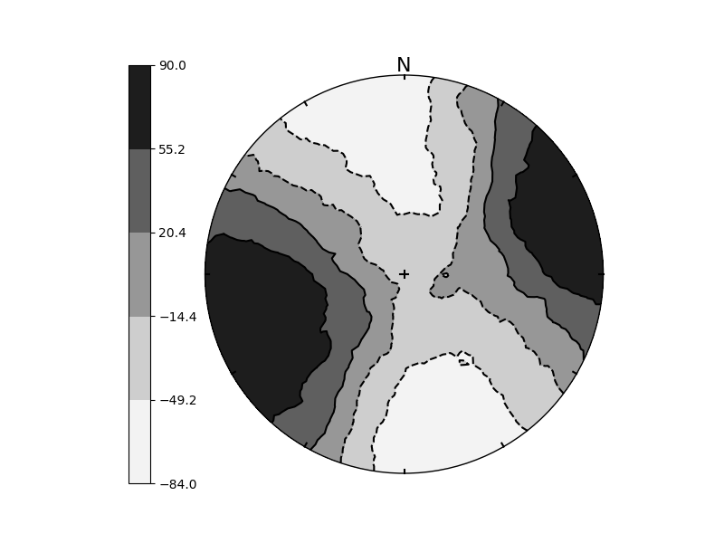

Setting method to 'probability', maximum likelihood estimate is calculated.::

    >>> f = FaultSet.examples('MELE')
    >>> StereoNet(f.angmech(method='probability'))

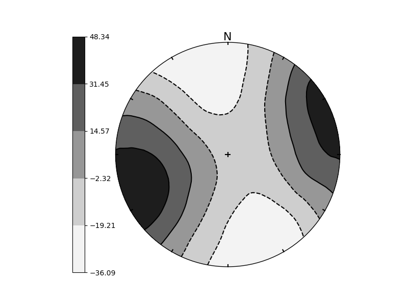

Fabric plots
------------
**APSG** provides several fabric plots to visualize Tensor-type objects (``Ortensor``,
``Ellipsoid``). ``FlinnPlot`` class provide classical Flinn's deformation diagram,

    >>> g1 = Group.examples('B2')
    >>> g2 = Group.examples('B4')
    >>> g3 = Group.uniform_lin(name='Uniform')
    >>> FlinnPlot(g1, g2, g3);

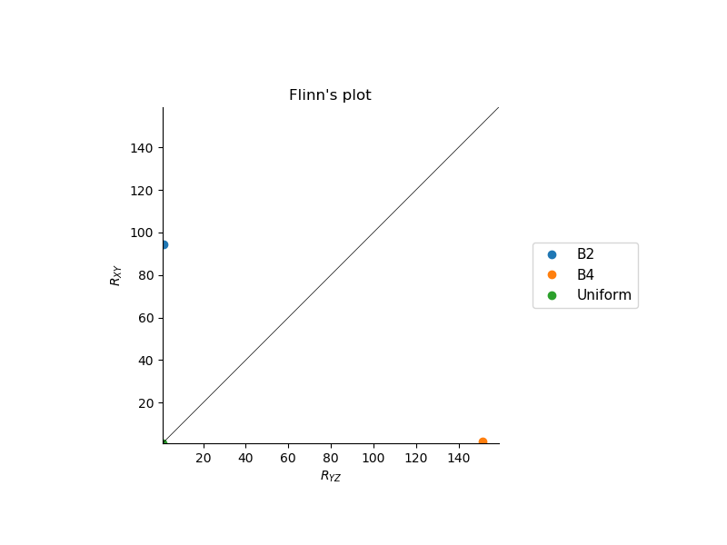

``RamsayPlot`` class provide Ramsay modification of Flinn's deformation diagram,

    >>> RamsayPlot(g1, g2, g3);

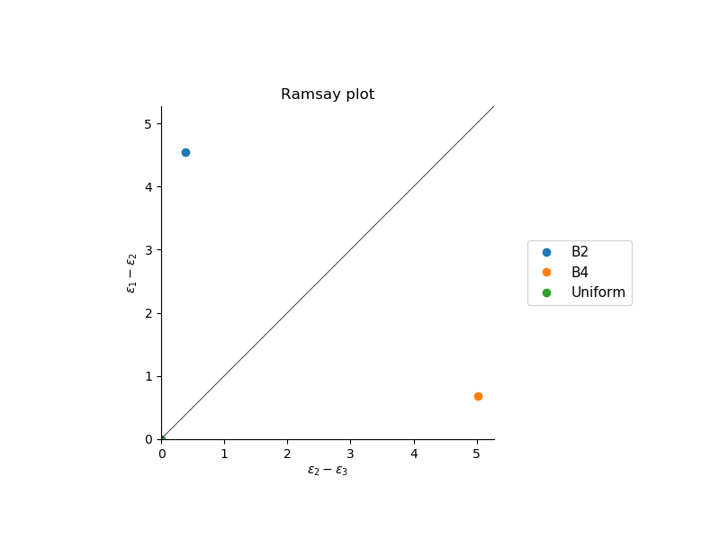

``VollmerPlot`` class provide triangular fabric plot (Vollmer, 1989),

    >>> VollmerPlot(g1, g2, g3);

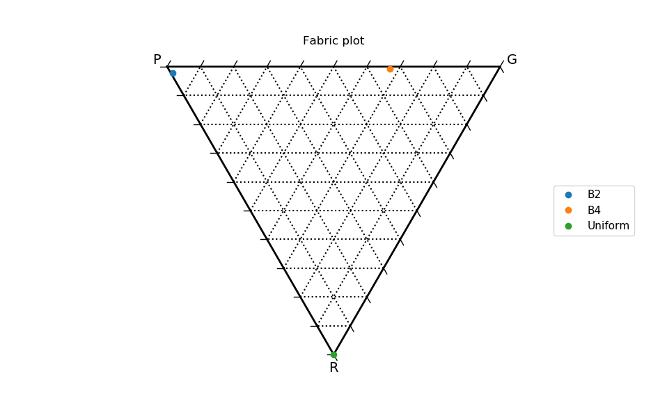

and ``HsuPlot`` class provide Hsu fabric diagram using natural strains.

    >>> HsuPlot(g1, g2, g3);

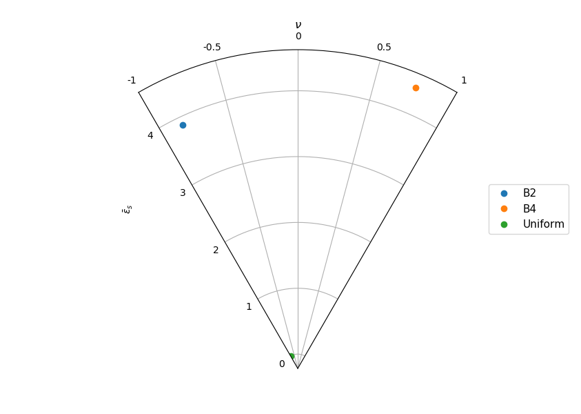

Cluster class
-------------

``Cluster`` class provide access to **scipy** hierarchical clustering.
Distance matrix is calculated as mutual angles of features within Group
keeping axial and/or vectorial nature in mind. ``Cluster.explain`` method
allows to explore explained variance versus number of clusters relation.
Actual cluster is done by ``Cluster.cluster`` method, using distance or
maxclust criterion. Using of ``Cluster`` is explained in following
example. We generate some data and plot dendrogram::

    >>> g1 = Group.randn_lin(mean=Lin(45,30))
    >>> g2 = Group.randn_lin(mean=Lin(320,56))
    >>> g3 = Group.randn_lin(mean=Lin(150,40))
    >>> g = g1 + g2 + g3
    >>> cl = Cluster(g)
    >>> cl.dendrogram(no_labels=True)

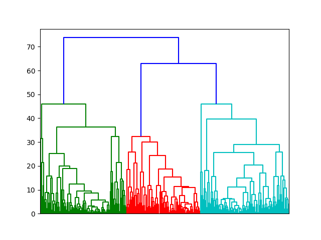

Now we can explore evolution of within-groups variance versus
number of clusters on Elbow plot (Note change in slope for
three clusters)::

   >>> cl.elbow()

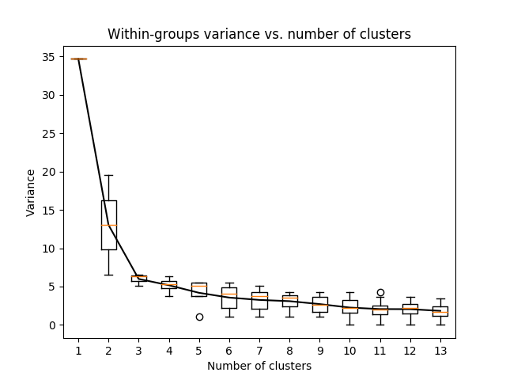

Finally we can do clustering and plot created clusters::

   >>> cl.cluster(maxclust=3)
   >>> cl.R.data  # Restored centres of clusters
   [L:146/39, L:43/26, L:323/59]
   >>> StereoNet(*cl.groups)

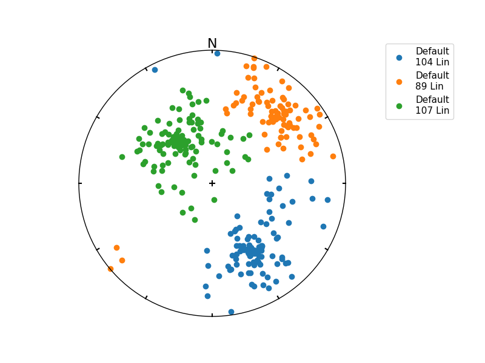

Some tricks
-----------

Double cross products are allowed but not easy to understand.

For example ``p**l**p`` is interpreted as ``p**(l**p)``: a) ``l**p`` is
plane defined by ``l`` and ``p`` normal b) intersection of this plane
and ``p`` is calculated::

    >>> p = Fol(250,40)
    >>> l = Lin(160,25)
    >>> StereoNet(p, l, l**p, p**l, l**p**l, p**l**p)

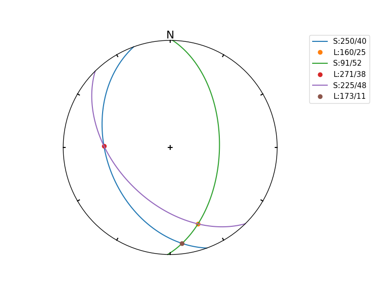

``Pair`` class could be used to correct measurements of planar linear
features which should spatialy overlap::

    >>> pl = Pair(250, 40, 160, 25)
    >>> pl.misfit
    18.889520432245405
    >>> s = StereoNet()
    >>> s.plane(Fol(250, 40), 'b', label='Original')
    >>> s.line(Lin(160, 25), 'bo', label='Original')
    >>> s.plane(pl.fol, 'g', label='Corrected')
    >>> s.line(pl.lin, 'go', label='Corrected')
    >>> s.show()

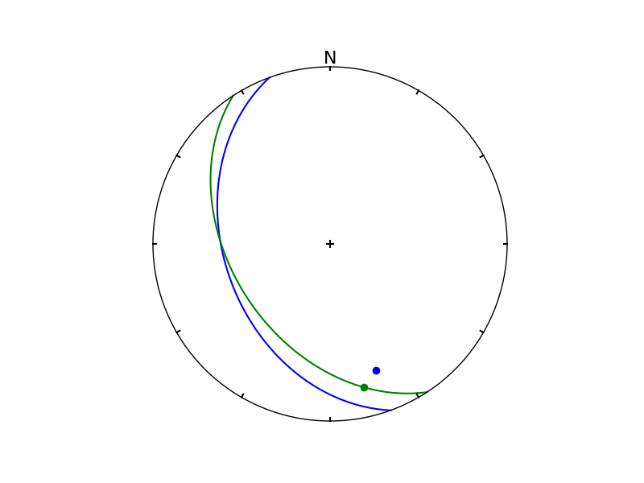

``StereoNet`` has method ``arrow`` to draw arrow. Here is example
of Hoeppner plot for variable fault orientation within given stress field::

    >>> S = Stress([[-8, 0, 0],[0, -5, 0],[0, 0, -1]]).rotate(Lin(90,45), 45)
    >>> d = StereoGrid(npoints=300)
    >>> s = StereoNet()
    >>> s.tensor(S)
    >>> for dc in d.dcgrid:
    >>>     f = S.fault(dc)
    >>>     s.arrow(f.fvec, f.lvec, f.sense)
    >>> s.show()

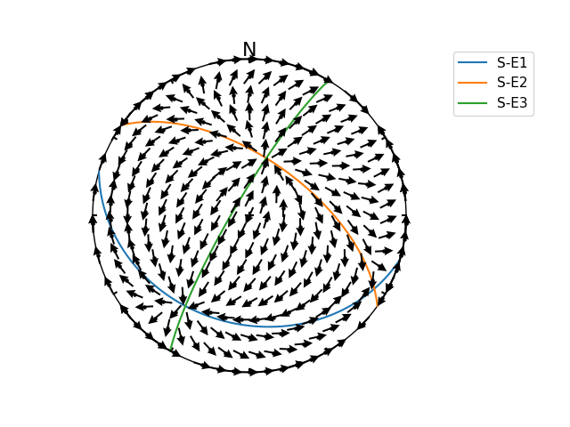
